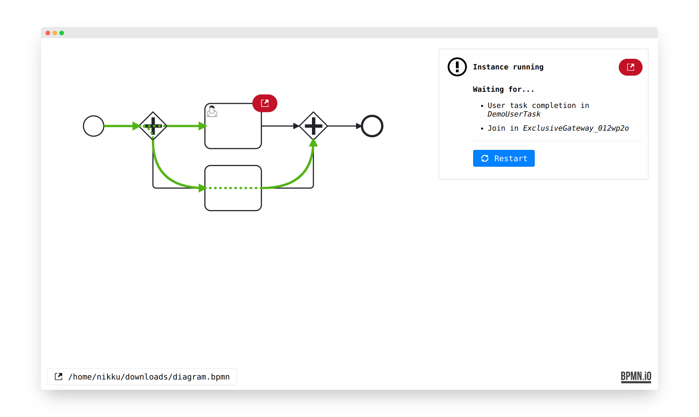

# camunda-playground

Try out and explore [Camunda](https://camunda.com/) in minutes, now hours.




## Usage

If you have [Node.js](https://nodejs.org/) installed, run the playground via:

```
npx camunda-playground foo.bpmn
```


## Resources

* [Issues](https://github.com/nikku/camunda-playground/issues)
* [Changelog](https://github.com/nikku/camunda-playground/blob/master/CHANGELOG.md)


## License

MIT